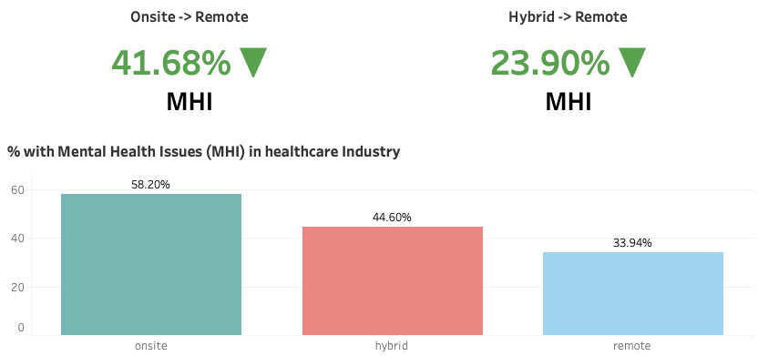
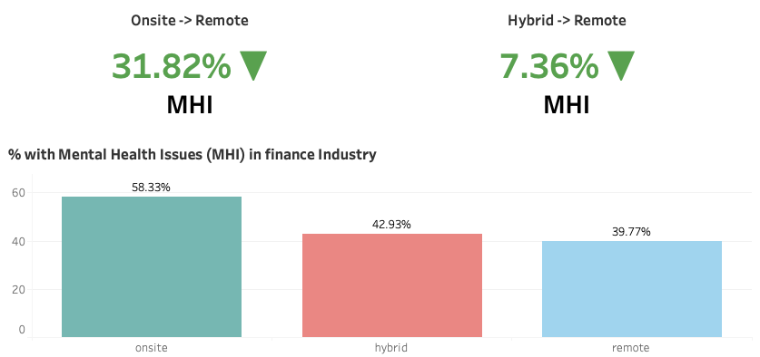
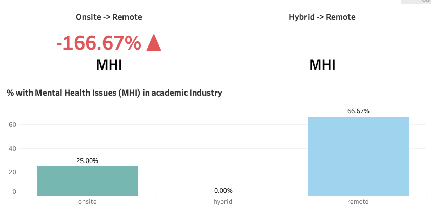
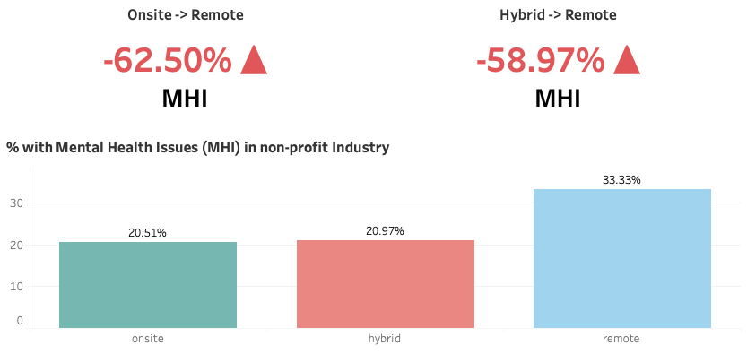
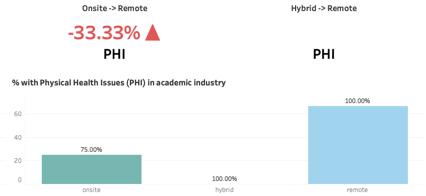
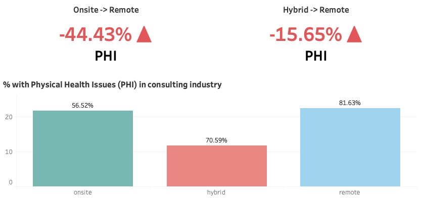
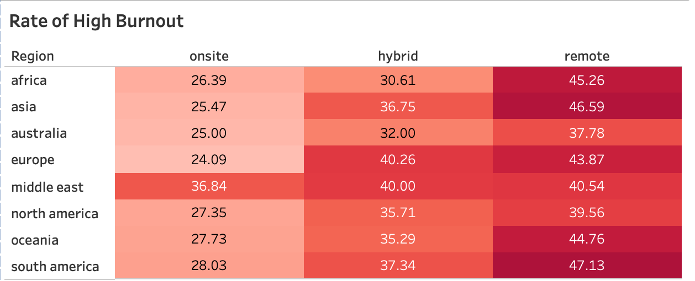
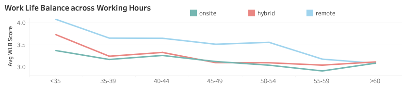
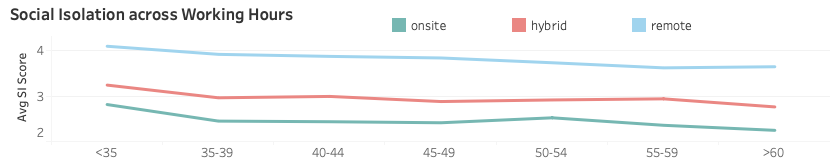

# Remote Work Health Analysis

## Table of Contents

- [Project Background](#project-background)
- [Data Structure Overview](#data-structure-overview)
- [Executive Summary](#executive-summary)
- [Insights Deep-Dive](#insights-deep-dive)
- [Recommendations](#recommendations)
- [Future Work](#future-work)

## Project Background

In a post-pandemic world, organizations are rethinking workplace policies to enhance employee well-being without compromising on their work productivity. This project aims to explore the effects of different work arrangements (Onsite, Remote or Hybrid) on an employee's well-being based on several factors: physical health, mental health, burnout level, social isolation and work-life balance. 

Insights and recommendations were provided on the following key areas:

**- Prevalence of Mental Health Issues:** Studying the amount of reported mental health issues across different work arrangements, with industry-specific observations.

**- Prevalence of Physical Health Issues:** Evaluating the physical health repercussions of employees across different work modes and industries.

**Burnout Rate Analysis** Identifying which regions experience the highest burnout rate across differing work arrangments.

**Work-Life Balance** Exploring how different categories of working hours influences the work-life balance of an employee with regards to their work arrangement.

**Degree of Social Isolation:**  Assessing the relationship between work arrangements and levels of social isolation, especially in extended remote setups.

## Data Structure Overview

The dataset was sourced from [Kaggle](https://www.kaggle.com/datasets/pratyushpuri/remote-work-health-impact-survey-2025/data) and was purposefully augmented to include more observations, and to also include missing values, formatting issues as well as inconsistent values to simulate real-world data.

**Key Metrics:**
- `Work_Arrangement`: Remote, Hybrid, Onsite
- `Mental_Health_Status_Binary` & `Physical_Health_Status_Binary`: 0, 1
- `Work_Life_Balance_Score` & `Social_Isolation_Score`: 1 (low) - 5 (high)
- `Burnout_Level`: Low, Medium, High
- Dimensions: `Region`, `Industry`, `Hours_Per_Week`

Prior to the beginning of analysis, a variety of checks were conducted for quality control and familiarization with the dataset. Data cleaning was done using Pandas, which can be viewed [here](./notebooks/01_eda.ipynb#5-data-cleaning).

## Executive Summary

Our analysis found that mental health outcomes improved significantly, with a 24.97% improvement in mental health outcomes when transitioning from onsite to remote work while physical health concerns remained largely unchanged. However, remote work has also been shown to be associated with higher instances of severe burnout, social isolation and poor work-life balance, especially with long working hours. These findings show that although remote work offers real benefits, its effectiveness also largely depends on how companies support employees ergonomically, psychologically and socially. The following sections will explore these trends in detail, supported by dashboard visualisations and actionable recommendations.

Below is an overview of the Tableau Dashboard and more examples are included throughout this report. The entire interactive dashboard can be viewed [here](./dashboards/remote_work_dashboard.twb)

## Insights Deep-Dive

### 1. Prevalence of Mental Health Issues

- Employees who work fully remote reported the lowest rate of mental health issues (42.86%) compared to employees working onsite (57.12%) and hybrid (47.30%). This indicates a general trend: as remote work exposure increases,  reported mental health issues decrease.

- Healthcare and Finance sectors show the strongest improvements when transitioning from onsite to remote work, with reductions of 41.68% and 31.82% respectively.

| Healthcare | Finance |
|------------|---------|
|  |  |

- Not all industries follow this trend. In the Academic and Non-Profit sectors, transitioning from onsite to remote work led to a 166.66% and 62.50% increase in reported mental health issues respectively. Additionally, switching from Hybrid to Remote in Non-Profit sectors caused a 58.97%.

| Academic | Non-Profit |
|----------|------------|
|  |  |

- Certain industries consistently show high levels of reported mental health issues with minimal differences across different work arrangements.

### 2. Prevalence of Physical Health Issues

- Reported physical health concerns across work arrangements appears high, ranging from 84% - 86% with no consistent trend favoring either arrangement.

- In certain sectors like Academic and Consulting, transitioning from onsite to remote work has led to a 33.33% and 44.43% increase in physical health issues respectively.

| Academic | Consulting |
|----------|------------|
|  |  |

- Remote work appears to exacerbate physical health problems and hybrid work does not seem to provide consistent benefits across industries, which could suggest that these physical health issues are likely to be related to job characteristics instead of work arrangement.

### 3. Analysis of High Burnout Rates

- The risk of severe burnout is significantly higher for remote employees in developing regions like Africa (45.3%), Asia (46.6%) and South America (47.1%) compared to those who work onsite. 

- In contrast, developed regions like North America (39.6%) and Australia (37.8%) report lower risk of severe burnout for remote workers, suggesting better remote work structure, policies and support systems. 

- The Middle East experiences high levels of severe burnout across all work arrangements, ranging from 36.8% to 40.5%, suggesting that cultural or organisational factors may also contribute to employee stress.

- Onsite work appears to show a lower risk of severe burnout (24% - 28%) apart from the Middle East.

- There is no one-size-fits-all approach to address burnout from work, and there is a need to account for regional infrastructure, workplace culture and employee support systems across various regions.

### 4. Analysing Work-Life Balance 

- Remote workers working less than 35 hours a week show the best work-life balance, with an average score of 3.99 - approximately 23% higher than onsite workers.

- When weekly working hours are below 45h, remote workers rank highest in work-life balance, followed by hybrid and then onsite workers. However, work-life balance begins to deteriorate noticeably after 45h, with the sharpest declines beyond 50 hours per week.

- Among remote workers, scores drop by 13%, from 3.51 (50–54h) to 3.05 (>60h). Hybrid workers maintain moderate but steady scores between 3.06–3.12, while onsite workers record the lowest balance at 2.96 (55–59h).

- The 45-49h range marks a critical threshold, as working hours past this point seems to narrow the gap in scores between the three working arrangements, and the benefits of remote work begin to disappear.

### 5. Analysing Social Isolation

- Remote workers consistently experience the highest levels of social isolation (3.57-4.07), followed by hybrid (2.75-3.19) and then onsite reporting the lowest levels (2.20-2.74) across all working hours.

- There is a strong indication that work arrangement influences levels of social isolation in employees, and is independent of the number of working hours per week.

- While remote work offers significant flexibility and autonomy, it also presents the risk of reduced interpersonal connections, especially in long-term or fully-remote setups. This underlines the importance of deliberate team-building and communication strategies to support the social well-being in remote teams.

## Recommendations

Based on the insights that were uncovered, the following recommendations are proposed:

**- Adopt Flexible and Context-Aware Work Policies:** Remote work can enhance mental health and work-life balance when implemented with proper support strategies, but it is not universally effective across all regions and industries. Work policies should be tailored based on employee needs, industry demands, and regional infrastructure rather than enforcing a one-size-fits-all approach.

**- Mitigate Physical Health Risks through Ergonomics and Routine:** Organizations should support remote and hybrid employees by promiting ergonomic practises, movement, and wellness. This includes offering ergonomic equipment subsidies, encouraging regular breaks, and providing access to wellness or fitness programs to reduce sedentary-related health issues.

**- Design Working Hours around a 45-hour threshold:** Working hours should be capped at 45 hours per week to maintain optimal work-life balance. Employees who constantly exceed this threshold should be flagged for potential burnout risk, and offered workload reviews or preventive interventions.

**- Foster more Company-Wide events to reduce Social Isolation:** To combat the elevated risk of social isolation in remote teams, companies should invest in team-building events, informal virtual hangouts, and cross-team collaboration opportunities to strengthen interpersonal relationships and psychological safety.

## Future Work

**- Exploring Hybrid Transitions:** This analysis focused on the impact of remote work relative to other arrangements. However, certain roles cannot be performed fully remote, and can only be best performed in a hybrid arrangement. As such, future work could investigate stepwise transitions such as comparing onsite -> hybrid and hybrid -> remote setups for a more nuanced view of work flexibility.

**- Role-Based Customization:** Future analyses could incorporate job function data to understand how remote work affects different role types (e.g. creative vs operational vs client-centric), providing a more tailored basis for work policy decisions.

